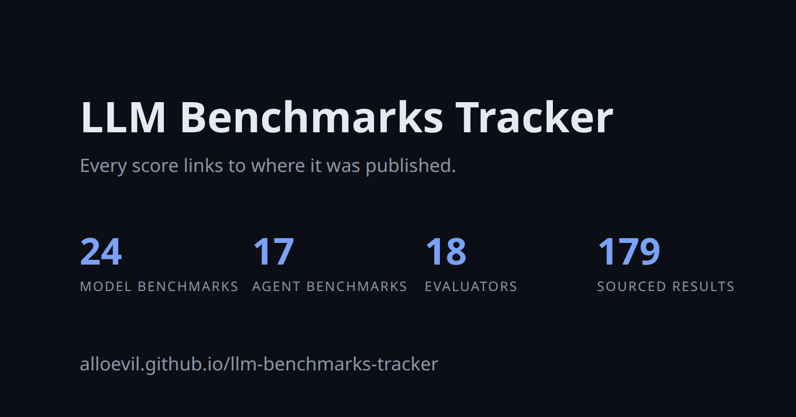

<div align="center">

# LLM Benchmarks Tracker

**A sourced, schema-validated catalogue of how language models and agents are measured.**

[**Browse the site**](https://alloevil.github.io/llm-benchmarks-tracker/) · [**中文**](README.zh-CN.md) · [**JSON API**](https://alloevil.github.io/llm-benchmarks-tracker/api/v1/index.json) · [**Add a result**](https://github.com/alloevil/llm-benchmarks-tracker/issues/new?template=result.yml) · [**Changelog**](CHANGELOG.md)

[](https://github.com/alloevil/llm-benchmarks-tracker/actions/workflows/ci.yml)
[](https://alloevil.github.io/llm-benchmarks-tracker/)
[](https://github.com/alloevil/llm-benchmarks-tracker/releases)
[](https://github.com/alloevil/llm-benchmarks-tracker/commits/main)
[](LICENSE)

[](https://alloevil.github.io/llm-benchmarks-tracker/)

</div>

For every benchmark: what it tests, whether it still discriminates between frontier systems (`status`), how exposed its test set is (`contamination_risk`), a measured human baseline when one exists, and who reported the top score under which conditions.

<!-- gen:stats -->
**31** model benchmarks · **23** agent benchmarks · **18** evaluators · **250** sourced results · updated 2026-09-04
<!-- /gen:stats -->

**Why another list?** Most benchmark pages copy vendor slide numbers with no provenance. Here every result row carries a source URL, a source *kind* (official leaderboard / paper / independent re-run / developer self-report / aggregator), the access date, and the evaluation conditions (tools, reasoning effort, scaffold, pass@k). Numbers without a source do not get in.

| Resource | URL |
|---|---|
| Site | <https://alloevil.github.io/llm-benchmarks-tracker/> · [中文](https://alloevil.github.io/llm-benchmarks-tracker/zh/) |
| API index | <https://alloevil.github.io/llm-benchmarks-tracker/api/v1/index.json> |
| All benchmarks + SOTA | <https://alloevil.github.io/llm-benchmarks-tracker/api/v1/benchmarks.json> |
| Per-benchmark ledger | `https://alloevil.github.io/llm-benchmarks-tracker/api/v1/results/<id>.json` |
| Schemas | [`schema/`](schema/) (JSON Schema 2020-12) |

## Contents

- [Model benchmarks](#model-benchmarks)
- [Agent benchmarks](#agent-benchmarks)
- [Evaluators](#evaluators)
- [Timeline](#timeline)
- [Data model](#data-model)
- [Using the data](#using-the-data)
- [Contributing](#contributing)

## Model benchmarks

Static prompt-and-response scoring of the model itself. *Top score* is the best row in the results ledger, not a model ranking; conditions differ between rows. Newest first.

<!-- gen:model -->
| Benchmark | Released | Domains | Status | Top score | System | Source |
|---|---|---|---|---|---|---|
| [BenchCAD](https://benchcad.com/leaderboard) | 2026-05 | multimodal, code, reasoning | active | 0.843 | Claude Fable 5.1 (max, Python tools) | [self-reported](https://benchcad.com/leaderboard) |
| [AA-Omniscience](https://artificialanalysis.ai/evaluations/omniscience) | 2025-11 | knowledge, factuality | active | 44 | GPT-6 Astra (high) | [independent](https://artificialanalysis.ai/evaluations/omniscience) |
| [GDPval](https://openai.com/index/gdpval/) | 2025-09 | general-assistant, knowledge, instruction-following | active | 74.1% | GPT-5.2 Pro | [self-reported](https://openai.com/index/introducing-gpt-5-2/) |
| [HealthBench](https://openai.com/index/healthbench/) | 2025-05 | knowledge, safety, instruction-following | active | 59.9% | o3 | [paper](https://arxiv.org/abs/2505.08775) |
| [ARC-AGI-2](https://arcprize.org/leaderboard) | 2025-03 | reasoning | saturating | 95% | GPT-6 Astra (Max) | [official](https://arcprize.org/leaderboard) |
| [ScreenSpot-Pro](https://gui-agent.github.io/grounding-leaderboard/) | 2025-01 | computer-use, multimodal | saturating | 92.7% | GPT-6 Astra | [self-reported](https://openai.com/index/gpt-6-astra/) |
| [Humanity's Last Exam](https://lastexam.ai/) | 2025-01 | knowledge, reasoning, science, math, multimodal | active | 65% | Claude Fable 5.1 (with tools) | [self-reported](https://www.anthropic.com/claude-fable-and-mythos-5-1) |
| [Aider Polyglot](https://aider.chat/docs/leaderboards/) | 2024-12 | code, instruction-following | saturating | 88% | gpt-5 (high) | [official](https://aider.chat/docs/leaderboards/) |
| [SimpleQA](https://openai.com/index/introducing-simpleqa/) | 2024-11 | factuality, knowledge | active | 62.5% | gpt-4.5-preview-2025-02-27 | [self-reported](https://github.com/openai/simple-evals) |
| [FrontierMath](https://epoch.ai/benchmarks/frontiermath-tiers-1-3-v2) | 2024-11 | math, reasoning, research | saturating | 93.7% | gpt-6-astra (max) | [independent](https://epoch.ai/benchmarks/frontiermath-tiers-1-3-v2) |
| [MMMU-Pro](https://mmmu-benchmark.github.io/#leaderboard) | 2024-09 | multimodal, knowledge, reasoning | active | 86.9% | Chance Vision 1.5 | [self-reported](https://mmmu-benchmark.github.io/) |
| [MMLU-Pro](https://huggingface.co/spaces/TIGER-Lab/MMLU-Pro) | 2024-06 | knowledge, reasoning | saturating | 91% | Gemini 3.1 Pro (High) | [independent](https://huggingface.co/deepseek-ai/DeepSeek-V4-Pro) |
| [RULER](https://github.com/NVIDIA/RULER) | 2024-04 | long-context | saturating | 95.1% | Jamba-1.5-large | [official](https://github.com/NVIDIA/RULER) |
| [LiveCodeBench](https://livecodebench.github.io/leaderboard.html) | 2024-03 | code, reasoning | active | 93.5% | DeepSeek-V4-Pro (Think Max) | [self-reported](https://huggingface.co/deepseek-ai/DeepSeek-V4-Pro) |
| [BFCL](https://gorilla.cs.berkeley.edu/leaderboard.html) | 2024-02 | tool-use | active | 77.47% | Claude-Opus-4-5-20251101 (FC) | [official](https://gorilla.cs.berkeley.edu/leaderboard.html) |
| [MMMU](https://mmmu-benchmark.github.io/#leaderboard) | 2023-11 | multimodal, knowledge, reasoning | saturating | 85.4% | GPT-5.1 | [self-reported](https://mmmu-benchmark.github.io/) |
| [IFEval](https://github.com/google-research/google-research/tree/master/instruction_following_eval) | 2023-11 | instruction-following | saturating | 95% | Qwen3.5-27B | [self-reported](https://huggingface.co/Qwen/Qwen3.5-27B) |
| [GPQA Diamond](https://github.com/idavidrein/gpqa) | 2023-11 | science, reasoning, knowledge | saturating | 96% | GPT-6 Astra | [aggregator](https://benchlm.ai/benchmarks/gpqa-diamond) |
| [LMArena Text](https://lmarena.ai/leaderboard/text) | 2023-05 | human-preference, general-assistant | active | 1466 | gemini-2.5-pro | [official](https://huggingface.co/spaces/lmarena-ai/arena-leaderboard) |
| *Saturated or retired — no longer used to compare frontier systems. Score shown is the last one reported, not a leaderboard top.* | | | | | | |
| [AIME 2025](https://matharena.ai/) | 2025-02 | math, reasoning | saturated | last reported 100% | GPT-5.2 (high) | [independent](https://matharena.ai/) |
| [BIG-Bench Hard](https://github.com/suzgunmirac/BIG-Bench-Hard) | 2022-10 | reasoning | saturated | last reported 87.5% | DeepSeek-V4-Pro-Base | [self-reported](https://huggingface.co/deepseek-ai/DeepSeek-V4-Pro) |
| [GSM8K](https://github.com/openai/grade-school-math) | 2021-10 | math, reasoning | saturated | last reported 92.6% | DeepSeek-V4-Pro-Base | [self-reported](https://huggingface.co/deepseek-ai/DeepSeek-V4-Pro) |
| [TruthfulQA](https://github.com/sylinrl/TruthfulQA) | 2021-09 | factuality, safety | saturated | last reported 58% | GPT-3-175B (helpful prompt) | [paper](https://arxiv.org/abs/2109.07958) |
| [MBPP](https://github.com/google-research/google-research/tree/master/mbpp) | 2021-08 | code | saturated | last reported 88.6% | Llama 3.1 405B Instruct | [self-reported](https://huggingface.co/meta-llama/Llama-3.1-70B-Instruct) |
| [HumanEval](https://github.com/openai/human-eval) | 2021-07 | code | saturated | last reported 76.8% | DeepSeek-V4-Pro-Base | [self-reported](https://huggingface.co/deepseek-ai/DeepSeek-V4-Pro) |
| [MATH](https://epoch.ai/benchmarks/math-level-5) | 2021-03 | math, reasoning | saturated | last reported 98.1% | o3-high | [self-reported](https://github.com/openai/simple-evals) |
| [MMLU](https://github.com/hendrycks/test) | 2020-09 | knowledge, reasoning | saturated | last reported 90.1% | DeepSeek-V4-Pro-Base | [self-reported](https://huggingface.co/deepseek-ai/DeepSeek-V4-Pro) |
| [ARC-AGI-1](https://arcprize.org/leaderboard) | 2019-11 | reasoning | saturated | last reported 98.5% | GPT-6 Astra (XHigh) | [official](https://arcprize.org/leaderboard) |
| [WinoGrande](https://winogrande.allenai.org/) | 2019-07 | commonsense, reasoning | saturated | last reported 81.5% | DeepSeek-V4-Pro-Base | [self-reported](https://huggingface.co/deepseek-ai/DeepSeek-V4-Pro) |
| [HellaSwag](https://rowanzellers.com/hellaswag/) | 2019-05 | commonsense | saturated | last reported 88% | DeepSeek-V4-Pro-Base | [self-reported](https://huggingface.co/deepseek-ai/DeepSeek-V4-Pro) |
| [DROP](https://github.com/allenai/allennlp-reading-comprehension) | 2019-03 | reasoning, knowledge | saturated | last reported 88.7% | DeepSeek-V4-Pro-Base | [self-reported](https://huggingface.co/deepseek-ai/DeepSeek-V4-Pro) |
<!-- /gen:model -->

## Agent benchmarks

Interactive environments where the system acts, uses tools, and is scored on task completion. Scaffold and budget move scores by tens of points; read `conditions` before comparing. Newest first.

<!-- gen:agent -->
| Benchmark | Released | Domains | Status | Top score | System | Source |
|---|---|---|---|---|---|---|
| [OSWorld 2.0](https://osworld-v2.xlang.ai/) | 2026-06 | computer-use, multimodal, tool-use | active | 41.7% | Claude Fable 5.1 | [self-reported](https://www.anthropic.com/claude-fable-and-mythos-5-1) |
| [AutomationBench](https://zapier.com/benchmarks) | 2026-04 | tool-use, general-assistant, instruction-following | active | 50.3% | Claude Opus 5 (max) | [official](https://github.com/zapier/AutomationBench) |
| [ARC-AGI-3](https://arcprize.org/leaderboard) | 2026-03 | reasoning, tool-use | saturating | 99.9% | GPT-6 Astra (high) | [official](https://arcprize.org/blog/astra) |
| [Terminal-Bench](https://www.tbench.ai/leaderboard) | 2026-01 | software-engineering, code, tool-use, ml-engineering | active | 64.6% | GPT-6 Astra | [self-reported](https://openai.com/index/gpt-6-astra/) |
| [DeepSearchQA](https://www.kaggle.com/benchmarks/google/dsqa/leaderboard) | 2025-12 | web, research, factuality, tool-use | active | 95% | Claude Opus 5 | [aggregator](https://benchlm.ai/benchmarks/deepsearchqa) |
| [Tool Decathlon (Toolathlon)](https://toolathlon.xyz/docs/leaderboard) | 2025-10 | tool-use, general-assistant, software-engineering | active | 78.4% | GLM 5.3 Flash (max) | [official](https://toolathlon.xyz/docs/leaderboard) |
| [SWE-Bench Pro](https://labs.scale.com/leaderboard/swe_bench_pro_public) | 2025-09 | software-engineering, code, tool-use | active | 61.5% | Muse Spark 1.1 | [official](https://labs.scale.com/leaderboard/swe_bench_pro_public) |
| [tau2-bench](https://taubench.com/leaderboard?benchmark=core) | 2025-06 | tool-use, instruction-following, general-assistant | active | 87.9% | Qwen3.5-397B-A17B | [official](https://taubench.com) |
| [FieldWorkArena](https://en-documents.research.global.fujitsu.com/fieldworkarena/) | 2025-05 | multimodal, general-assistant, safety, reasoning | active | 52% | GPT-5.2 (2025-12-11) | [paper](https://arxiv.org/abs/2505.19662) |
| [PaperBench](https://github.com/openai/frontier-evals/tree/main/project/paperbench) | 2025-04 | research, ml-engineering, code, tool-use | active | 43.4% | IterativeAgent o1-high | [official](https://github.com/openai/frontier-evals/tree/main/project/paperbench) |
| [BrowseComp](https://openai.com/index/browsecomp/) | 2025-04 | web, tool-use, factuality, reasoning | saturating | 92.2% | GPT-5.6 Sol | [aggregator](https://benchlm.ai/benchmarks/browsecomp) |
| [SWE-bench Multilingual](https://www.swebench.com/#multilingual) | 2025-03 | software-engineering, code, tool-use | active | 72.7% | Gemini 3 Flash | [official](https://www.swebench.com/#multilingual) |
| [MLE-bench](https://github.com/openai/mle-bench) | 2024-10 | ml-engineering, code, tool-use | active | 64.44% | Famou-Agent 2.0 + Gemini-3-Pro-Preview | [official](https://github.com/openai/mle-bench) |
| [SWE-bench Verified](https://www.swebench.com/#verified) | 2024-08 | software-engineering, code, tool-use | saturating | 96% | Claude Opus 5 | [aggregator](https://benchlm.ai/benchmarks/swe-bench-verified) |
| [OSWorld](https://os-world.github.io) | 2024-04 | computer-use, multimodal, tool-use | active | 90.19% | Intelligence-Indeed Agent | [official](https://os-world.github.io) |
| [VisualWebArena](https://docs.google.com/spreadsheets/d/1M801lEpBbKSNwP-vDBkC_pF7LdyGU1f_ufZb_NWNBZQ/edit?gid=2044883967#gid=2044883967) | 2024-01 | web, multimodal, computer-use | active | 54% | Gemini 2.5 Flash (SGV) | [official](https://docs.google.com/spreadsheets/d/1M801lEpBbKSNwP-vDBkC_pF7LdyGU1f_ufZb_NWNBZQ/edit?gid=2044883967#gid=2044883967) |
| [GAIA](https://huggingface.co/spaces/gaia-benchmark/leaderboard) | 2023-11 | general-assistant, tool-use, web, reasoning, multimodal | saturating | 93.36% | CustomGPT.ai Research Lab v44 | [official](https://huggingface.co/spaces/gaia-benchmark/leaderboard) |
| [WebArena](https://docs.google.com/spreadsheets/d/1M801lEpBbKSNwP-vDBkC_pF7LdyGU1f_ufZb_NWNBZQ/edit?usp=sharing) | 2023-07 | web, tool-use, computer-use | active | 74.3% | WebTactix + Deepseek v3.2 | [official](https://docs.google.com/spreadsheets/d/1M801lEpBbKSNwP-vDBkC_pF7LdyGU1f_ufZb_NWNBZQ/edit?usp=sharing) |
| *Saturated or retired — no longer used to compare frontier systems. Score shown is the last one reported, not a leaderboard top.* | | | | | | |
| [Cybench](https://cybench.github.io/#leaderboard_title) | 2024-08 | safety, code, tool-use | saturated | last reported 96% | Claude Opus 4.7 | [self-reported](https://cybench.github.io) |
| [tau-bench](https://github.com/sierra-research/tau-bench) | 2024-06 | tool-use, instruction-following, general-assistant | retired | last reported 69.2% | TC (claude-3-5-sonnet-20241022), retail | [official](https://github.com/sierra-research/tau-bench) |
| [AndroidWorld](https://docs.google.com/spreadsheets/d/1cchzP9dlTZ3WXQTfYNhh3avxoLipqHN75v1Tb86uhHo/edit?gid=0#gid=0) | 2024-05 | computer-use, multimodal, tool-use | saturated | last reported 85.3% | Qwen3.8 Max | [aggregator](https://benchlm.ai/benchmarks/androidworld) |
| [SWE-bench](https://www.swebench.com/#test) | 2023-10 | software-engineering, code, tool-use | saturated | last reported 52.62% | Sonar Foundation Agent + Claude 4.5 Opus | [official](https://www.swebench.com/#test) |
| [AgentBench](https://docs.google.com/spreadsheets/d/e/2PACX-1vRR3Wl7wsCgHpwUw1_eUXW_fptAPLL3FkhnW_rua0O1Ji_GIVrpTjY5LaKAhwO-WeARjnY_KNw0SYNJ/pubhtml) | 2023-08 | tool-use, reasoning, web, code | retired | last reported 3.11 | claude-3 opus | [paper](https://arxiv.org/abs/2308.03688) |
<!-- /gen:agent -->

## Evaluators

Frameworks you run, leaderboards run by maintainers, organisations that independently re-run models, and aggregators that republish reported numbers. Independence matters: self-reported scores are routinely higher than independent re-runs of the same model.

<!-- gen:evaluators -->
| Evaluator | Kind | Maintainer | Methodology | Status |
|---|---|---|---|---|
| [DeepEval](https://deepeval.com) | framework | Confident AI | self-run | active |
| [EvalScope](https://evalscope.readthedocs.io/en/latest/) | framework | ModelScope (Alibaba) | self-run | active |
| [HELM](https://crfm.stanford.edu/helm/) | framework | Stanford CRFM | self-run | archived |
| [Inspect AI](https://inspect.aisi.org.uk/) | framework | UK AI Security Institute | self-run | active |
| [Lighteval](https://huggingface.co/docs/lighteval/en/index) | framework | Hugging Face | self-run | active |
| [LM Evaluation Harness](https://github.com/EleutherAI/lm-evaluation-harness) | framework | EleutherAI | self-run | active |
| [OpenAI Evals](https://platform.openai.com/docs/guides/evals) | framework | OpenAI | self-run | archived |
| [OpenCompass](https://opencompass.org.cn/) | framework | Shanghai AI Laboratory (OpenCompass team) | self-run | active |
| [Holistic Agent Leaderboard (HAL)](https://hal.cs.princeton.edu) | leaderboard | Princeton University (SAgE team) | self-run | active |
| [LiveBench](https://livebench.ai) | leaderboard | LiveBench team (Abacus.AI, NYU and collaborators) | self-run | active |
| [LMArena](https://lmarena.ai) | leaderboard | Arena (LMArena, spun out of LMSYS / UC Berkeley) | crowdsourced | active |
| [Open LLM Leaderboard](https://huggingface.co/spaces/open-llm-leaderboard/open_llm_leaderboard) | leaderboard | Hugging Face | submission | archived |
| [SWE-rebench](https://swe-rebench.com) | leaderboard | Nebius | self-run | active |
| [Artificial Analysis](https://artificialanalysis.ai) | independent-evaluator | Artificial Analysis | self-run | active |
| [Epoch AI Benchmarking Hub](https://epoch.ai/benchmarks) | independent-evaluator | Epoch AI | self-run | active |
| [Scale SEAL Leaderboards](https://scale.com/leaderboard) | independent-evaluator | Scale AI (SEAL Research Lab) | self-run | active |
| [Vals AI](https://www.vals.ai) | independent-evaluator | Vals AI | self-run | active |
| [BenchLM](https://benchlm.ai) | aggregator | BenchLM.ai (independent, maintained by @glevd) | collected | active |
<!-- /gen:evaluators -->

## Timeline

<!-- gen:timeline -->
- **2019** — ARC-AGI-1, DROP, HellaSwag, WinoGrande
- **2020** — MMLU
- **2021** — GSM8K, HumanEval, LM Evaluation Harness (framework), MATH, MBPP, TruthfulQA
- **2022** — BIG-Bench Hard, HELM (framework)
- **2023** — AgentBench, DeepEval (framework), GAIA, GPQA Diamond, IFEval, LMArena (leaderboard), LMArena Text, MMMU, Open LLM Leaderboard (leaderboard), OpenAI Evals (framework), OpenCompass (framework), SWE-bench, WebArena
- **2024** — Aider Polyglot, AndroidWorld, Artificial Analysis (independent-evaluator), BFCL, Cybench, Epoch AI Benchmarking Hub (independent-evaluator), EvalScope (framework), FrontierMath, Inspect AI (framework), Lighteval (framework), LiveBench (leaderboard), LiveCodeBench, MLE-bench, MMLU-Pro, MMMU-Pro, OSWorld, RULER, Scale SEAL Leaderboards (independent-evaluator), SimpleQA, SWE-bench Verified, tau-bench, Vals AI (independent-evaluator), VisualWebArena
- **2025** — AA-Omniscience, AIME 2025, ARC-AGI-2, BenchLM (aggregator), BrowseComp, DeepSearchQA, FieldWorkArena, GDPval, HealthBench, Holistic Agent Leaderboard (HAL) (leaderboard), Humanity's Last Exam, PaperBench, ScreenSpot-Pro, SWE-bench Multilingual, SWE-Bench Pro, SWE-rebench (leaderboard), tau2-bench, Tool Decathlon (Toolathlon)
- **2026** — ARC-AGI-3, AutomationBench, BenchCAD, OSWorld 2.0, Terminal-Bench
<!-- /gen:timeline -->

## Data model

```
data/
  benchmarks/<id>.json     one file per benchmark          schema/benchmark.schema.json
  results/<id>.json        append-only score ledger         schema/results.schema.json
  evaluators/<id>.json     framework / leaderboard / ...    schema/evaluator.schema.json
```

Key fields:

| Field | Meaning |
|---|---|
| `layer` | `model` (static scoring) or `agent` (interactive environment) |
| `status` | `active` still separates frontier systems · `saturating` within ~5 pts of ceiling or human baseline · `saturated` no longer discriminative · `retired` maintainer stopped |
| `contamination_risk` | `low` live/rolling/private test set · `medium` public with mitigations · `high` public, static, widely scraped |
| `description_zh` | Simplified Chinese translation of `description`; names and metrics stay in Latin script |
| `human_baseline` | only when a measured number with a source exists |
| `results[].source.kind` | `official-leaderboard` · `paper` · `independent-evaluation` · `developer-report` · `aggregator` |
| `results[].conditions` | `split`, `tools`, `reasoning_effort`, `scaffold`, `pass_k`, `shots`, `cost_usd_per_task`, `notes` — omit what is unknown, never guess |

Results ledgers are append-only: a new score is a new row, never an edit. `scripts/dataset.py::Dataset.sota()` picks the best row according to `metric.higher_is_better`.

## Using the data

```python
import json, urllib.request
api = "https://alloevil.github.io/llm-benchmarks-tracker/api/v1/"
benchmarks = json.load(urllib.request.urlopen(api + "benchmarks.json"))["benchmarks"]
active = [b for b in benchmarks if b["status"] == "active" and b["layer"] == "agent"]
for b in active:
    s = b["sota"]
    print(b["name"], s and f'{s["value"]} {s["system"]} ({s["source"]["kind"]})')
```

Locally:

```bash
pip install -e ".[dev]"
python scripts/validate.py          # schema + cross-file invariants
python scripts/build.py             # regenerate README tables (en + zh), dist/ site and API
pytest                              # validator contract tests
```

## Contributing

Two tiers of provenance. **Structured official/independent sources** (ARC Prize leaderboard JSON, BFCL CSV, Epoch AI data export, Aider leaderboard YAML) carry system, score and conditions in machine-readable form, so [`sync.yml`](.github/workflows/sync.yml) appends new top scores from them automatically twice a week (`scripts/sync_ledgers.py`; schema validation, append-only ordering and duplicate checks gate every write, and git history is the audit log). **Everything else** — vendor posts, aggregators, new benchmarks — is added by people. See [CONTRIBUTING.md](CONTRIBUTING.md). Short version: edit or add a JSON file under `data/`, run `python scripts/validate.py && python scripts/build.py`, open a PR. CI rejects schema violations, dangling references, unsourced rows, and stale README tables.

## Citation

```bibtex
@misc{llm-benchmarks-tracker,
  title  = {LLM Benchmarks Tracker},
  author = {alloevil and contributors},
  year   = {2026},
  url    = {https://github.com/alloevil/llm-benchmarks-tracker}
}
```

## License

Code and data are released under the [MIT License](LICENSE). Benchmark names, papers and scores belong to their respective authors; each entry links to them.
